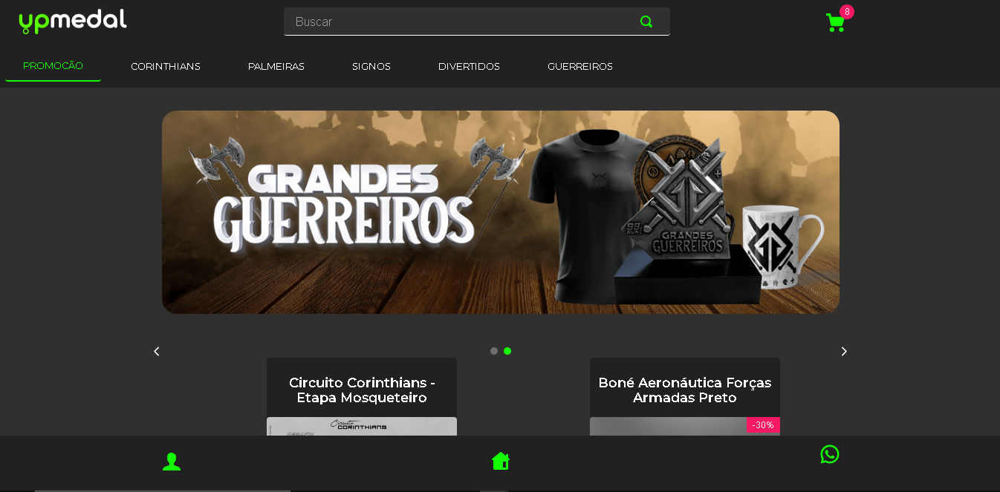
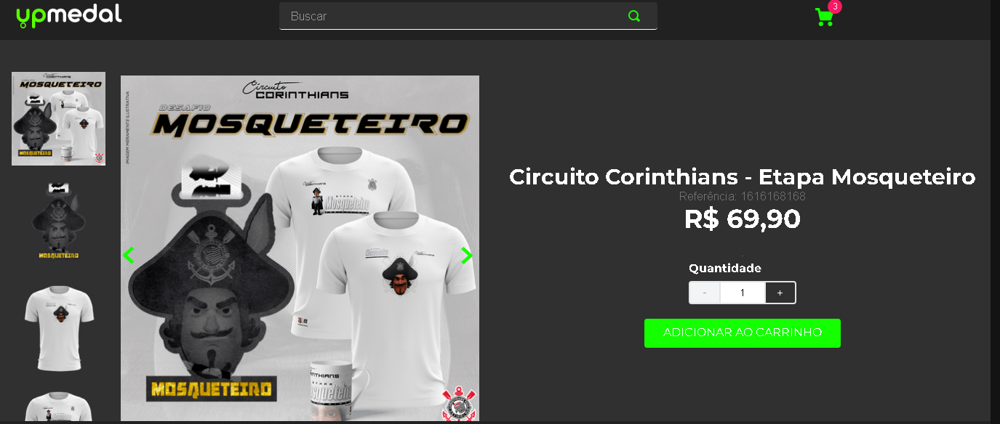
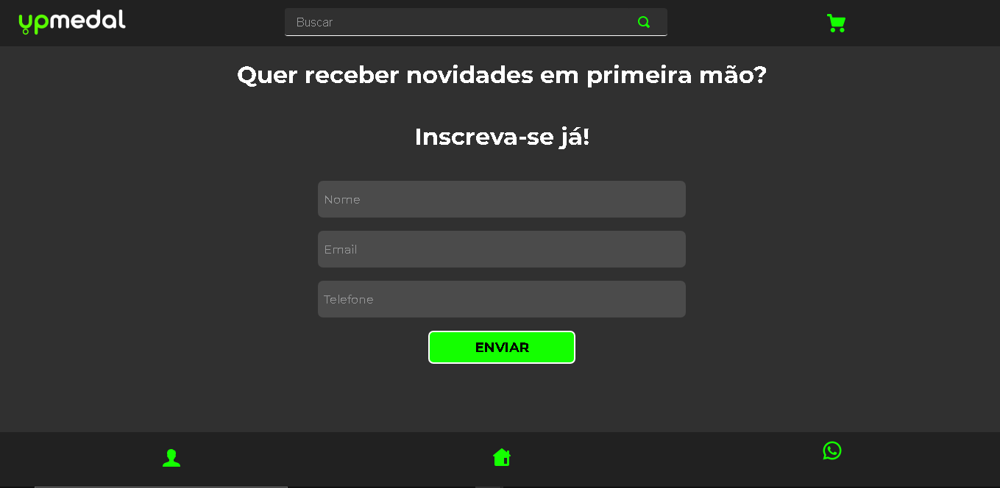
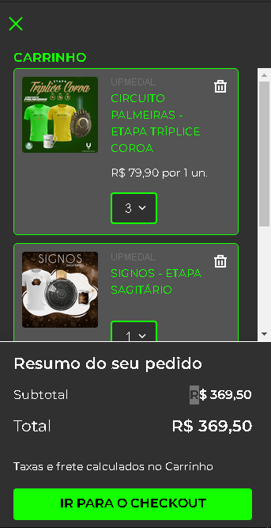

# Desafio 3 - Hiring Coders
## Criar um Ecommerce utilizando Vtex IO

### A aplicação - Loja UpMedal

Este projeto tem o objetivo simular um ecommerce simples contendo um carrossel principal, uma prateleira de produtos, formulário de cadastro e link para falar com suporte via whatsapp. 

### Tecnologias utilizadas

- Vtex IO
- React
- Typescript

### Páginas

- Home:

- Prateleira de Produtos:

- Página de Produto:

- Formulario:

- Header do site onde é possivel utilizar da barra de busca, minicart e da categorização dos produtos:

- Footer do site onde é possivel utilizar para navegar para a página do formulario, página Home e abrir o suporte pelo Whatsapp:

- Minicart do site, onde é possivel visualizar os produtos que foram selecionados para compra, seguido pelo botão que leva ao checkout:

Feito com ❤️ por <strong>Letícia Barbosa</strong> 👋🏽 [Entre em contato!](https://www.linkedin.com/in/let%C3%ADcia-barbosa-58a782193/)
